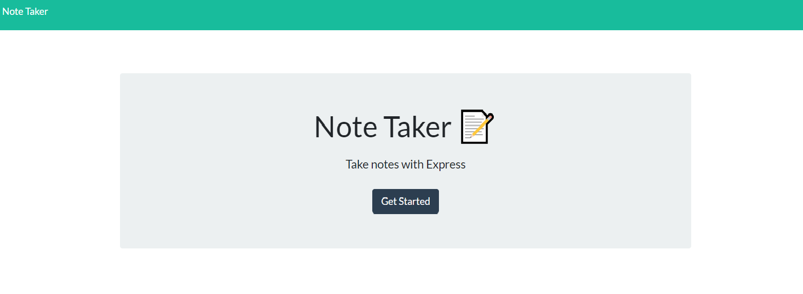
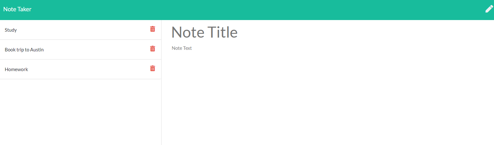

# Note-Taker

## Table of contents
* [General info](#general-info)
* [Technologies](#technologies)
* [Screenshots](#screenshots)
* [Credits](#credits)
* [License](#license)

## General info
This project is an application that can be used to write, save, and delete notes. It uses an express backend and saves and retrieves note data from a JSON file. 

Link to deployed application on Heroku: https://express-take-notes.herokuapp.com/ 

## Technologies
This project is created with: 
* Express.js
* Node.js 
* Bootstrap 4
* CSS
* Font Awesome
* HTML
* JavaScript
* Heroku

## Screenshots 

# Credits
The front end files (public folder assets in the file directory) were provided in my course materials and I consulted my course GitLab repository, Stack Overflow (www.stackoverflow.com), W3Schools (https://www.w3schools.com/js/js_array_methods.asp), MDN Web Docs (https://developer.mozilla.org/en-US/docs/Web/JavaScript/Reference/Global_Objects/Array/splice), and ExpressJS (https://expressjs.com/en/4x/api.html#app.post.method) in creating my project. 

## License
MIT License

Copyright (c) [2020] [Rachel Rohrbach]

Permission is hereby granted, free of charge, to any person obtaining a copy
of this software and associated documentation files (the "Software"), to deal
in the Software without restriction, including without limitation the rights
to use, copy, modify, merge, publish, distribute, sublicense, and/or sell
copies of the Software, and to permit persons to whom the Software is
furnished to do so, subject to the following conditions:

The above copyright notice and this permission notice shall be included in all
copies or substantial portions of the Software.